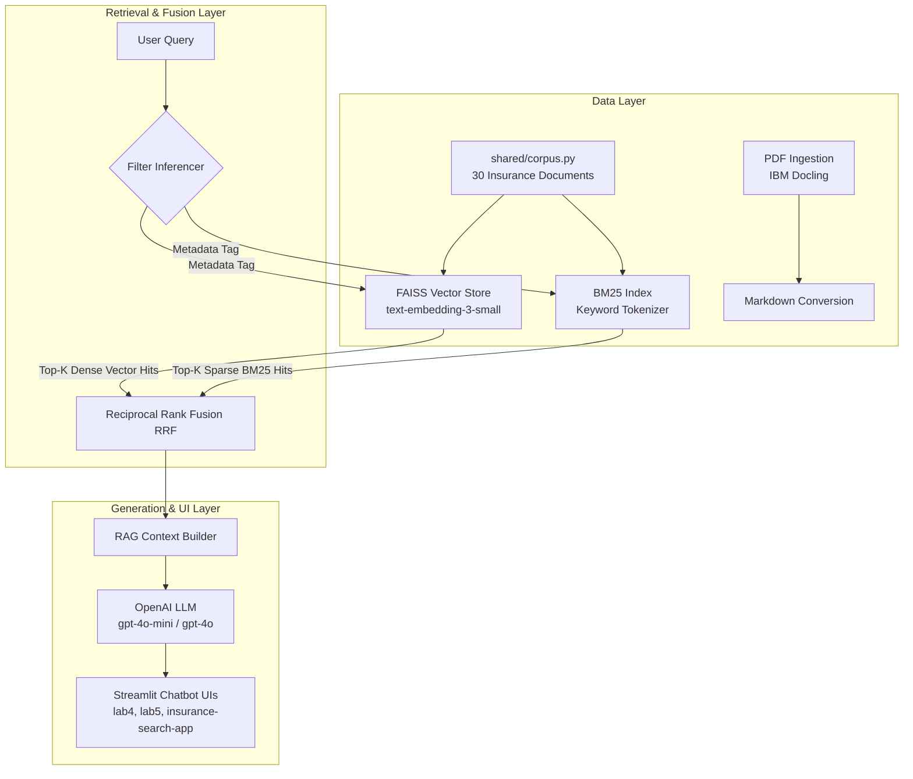

# 🛡️ Gen-AI & RAG Engineering Playground: InsureSafe

A comprehensive, lab-by-lab hands-on repository demonstrating modern **Generative AI**, **Retrieval-Augmented Generation (RAG)**, and **Vector Search Engine Architecture** applied to the Indian Insurance Domain (Health, Motor, and Life Insurance).

This project walks through the complete evolutionary path of building production-grade LLM applications—from basic prompt chains and stateful chat memory to advanced PDF extraction, chunking benchmarks, vector similarity search with FAISS, metadata filtering, BM25 keyword search, Reciprocal Rank Fusion (RRF) hybrid retrieval, and full-stack Streamlit web applications.

---

## 📌 Table of Contents

- [Overview](#-overview)
- [System Architecture](#-system-architecture)
- [Repository Structure](#-repository-structure)
- [Lab Breakdown](#-lab-breakdown)
- [Applications Overview](#-applications-overview)
- [Prerequisites & Requirements](#-prerequisites--requirements)
- [Installation & Setup](#-installation--setup)
- [How to Run Labs & Apps](#-how-to-run-labs--apps)
- [Key Findings & Benchmarks](#-key-findings--benchmarks)

---

## 🚀 Overview

The **InsureSafe** repository is designed as a modular learning and benchmarking suite for LLM/RAG developers. It covers essential techniques required to handle domain-specific document intelligence:

1. **Prompt Engineering & Chains**: LangChain LCEL (LangChain Expression Language) pipelines.
2. **Stateful Conversation Management**: Context buffer memory for multi-turn chats.
3. **Advanced Document Ingestion**: Layout-aware PDF conversion to Markdown using **IBM Docling** and structured JSON extraction.
4. **Context & Chunking Experiments**:
   - Impact of context window truncation on LLM recall.
   - Comparative analysis of character, recursive, token, and markdown text splitters.
   - Quantitative chunk size (256, 512, 1024 tokens) precision matrix.
5. **Dense Vector & Hybrid Retrieval**:
   - FAISS indexing with OpenAI `text-embedding-3-small`.
   - Metadata filtering & smart query filter inference.
   - BM25 + FAISS Hybrid Retrieval with Reciprocal Rank Fusion (RRF).
6. **Production UIs**: Interactive Streamlit web interfaces for policy document analysis and hybrid search exploration.

---

## 🏗️ System Architecture



---

## 📂 Repository Structure

```directory
Gen-AI/
├── shared/
│   └── corpus.py                  # Shared domain dataset (30 Documents across Health, Motor, Life)
├── lab1/
│   └── insurance_chain.py         # Basic LCEL prompt-to-LLM chain
├── lab2/
│   └── memory_chatbot.py          # Multi-turn conversation chatbot with memory buffer
├── lab3/
│   ├── sample_pdf.py              # ReportLab script generating synthetic policy PDFs
│   ├── pdf_extractor.py           # IBM Docling PDF markdown & JSON parser
│   ├── sample_pdfs/               # Generated sample PDF documents
│   └── results/                   # Extracted markdown outputs
├── lab4/
│   └── streamlit_app.py           # Streamlit AI Chatbot UI with session history
├── lab5/
│   └── chatbot.py                 # "InsureSafe Pro" Full-Stack RAG Chatbot (Streamlit + Docling)
├── lab6/
│   ├── truncation_experiment.py   # Benchmark measuring recall failure under context truncation
│   └── truncation_results.json    # JSON report of truncation experiment
├── lab7/
│   ├── chunking_strategies.py     # Comparison of 4 text splitting strategies
│   └── strategy_results.json      # Benchmark results of chunking strategies
├── lab8/
│   ├── chunk_size_experiment.py   # Precision matrix across 256, 512, 1024 token chunk sizes
│   └── chunk_experiment_results.json
├── lab9/
│   ├── faiss_search.py            # FAISS dense vector store creation & Euclidean similarity search
│   ├── faiss_insurance_index/     # Persisted FAISS index files (.faiss, .pkl)
│   └── lab9_results.json          # Search latency and scoring results
├── lab10/
│   ├── semantic_filter_search.py  # FAISS search with metadata filtering & Smart Auto-Filtering
│   └── lab10_results.json
├── lab11/
│   ├── hybrid_search.py           # BM25 + FAISS Hybrid Search with Reciprocal Rank Fusion (RRF)
│   └── lab11_results.json
├── insurance-bot/
│   ├── insurance-bot.py           # Evaluation script testing chunk retrieval accuracy
│   └── insurance_bot_results.json
├── insurance-search-app/
│   └── streamlitapp.py            # Full-featured Streamlit Hybrid Search & Filtering GUI
├── .env.example                   # Template for environment variables
└── README.md                      # Project documentation
```

---

## 🧪 Lab Breakdown

| Lab | Name | Focus & Description | Key Files |
|---|---|---|---|
| **Lab 1** | **LangChain LCEL Chains** | Initializing basic LCEL chains using `ChatPromptTemplate`, `ChatOpenAI`, and `StrOutputParser` for Indian insurance queries. | `lab1/insurance_chain.py` |
| **Lab 2** | **Conversational Memory** | Multi-turn chat persistence using `ConversationBufferMemory` and `ConversationChain`. | `lab2/memory_chatbot.py` |
| **Lab 3** | **PDF Document Ingestion** | Synthetic PDF generation (`ReportLab`) and layout-aware PDF conversion using **IBM Docling** to extract Markdown tables and structured JSON schema. | `lab3/sample_pdf.py`<br>`lab3/pdf_extractor.py` |
| **Lab 4** | **Streamlit Assistant UI** | Web-based chat interface with model dropdowns, temperature sliders, clear session state, and streaming outputs (`st.write_stream`). | `lab4/streamlit_app.py` |
| **Lab 5** | **InsureSafe Pro App** | Full-stack RAG web application combining dynamic PDF upload/processing, automated summary tables, and grounded policy Q&A. | `lab5/chatbot.py` |
| **Lab 6** | **Context Truncation** | Empirical test demonstrating LLM recall loss when large context documents (~8k tokens) are truncated to 75%, 50%, and 25%. | `lab6/truncation_experiment.py` |
| **Lab 7** | **Chunking Strategies** | Benchmark comparing `CharacterTextSplitter`, `RecursiveCharacterTextSplitter`, `TokenTextSplitter`, and `MarkdownHeaderTextSplitter`. | `lab7/chunking_strategies.py` |
| **Lab 8** | **Chunk Size Optimization** | Evaluating retrieval accuracy and latency across 256, 512, and 1024 token chunk targets. | `lab8/chunk_size_experiment.py` |
| **Lab 9** | **FAISS Vector Search** | Building, persisting, loading, and querying a local FAISS index with OpenAI `text-embedding-3-small`. | `lab9/faiss_search.py` |
| **Lab 10** | **Metadata Filtering** | Pre-filtering FAISS vector space by metadata (`policy_type`, `section`, `claim_type`) and auto-inferring metadata filters from user intent. | `lab10/semantic_filter_search.py` |
| **Lab 11** | **Hybrid RRF Retrieval** | Integrating BM25 sparse keyword retrieval with FAISS dense vector search using Reciprocal Rank Fusion (RRF: $RRF\_Score = \sum \frac{1}{k + r}$). | `lab11/hybrid_search.py` |

---

## 💻 Applications Overview

### 1. InsureSafe Pro Chatbot (`lab5/chatbot.py`)
- **PDF Upload**: Drag-and-drop any insurance policy document.
- **Auto-Summarization**: Uses GPT-4o-mini to convert document tables into executive coverage/exclusion markdown matrices.
- **Grounded Q&A**: Strict System Prompt grounding ensures zero hallucination outside uploaded policy bounds.

### 2. Insurance Hybrid Search App (`insurance-search-app/streamlitapp.py`)
- **Filter Navigation**: Toggle search across `All`, `Health`, `Motor`, or `Life` policy verticals.
- **Smart Natural Language Filtering**: Automatically maps queries containing terms like *"car"*, *"hospital"*, or *"nominee"* to corresponding metadata tags.
- **Vector Distance & Rank Inspection**: Visualizes metadata, chunk document IDs, and Euclidean distance metrics.

---

## ⚙️ Prerequisites & Requirements

- **Python**: `3.10+` recommended
- **OpenAI API Key**: Access to `gpt-4o-mini`, `gpt-4o`, and `text-embedding-3-small`.

### Core Dependencies:
- `langchain`, `langchain-openai`, `langchain-community`, `langchain-core`
- `docling` (IBM Document Converter)
- `streamlit` (Web Applications)
- `faiss-cpu` (Vector Database)
- `rank-bm25` (Sparse Keyword Search)
- `reportlab` (PDF Generator)
- `tiktoken` (Token Counting)
- `python-dotenv` (Environment Config)

---

## 📥 Installation & Setup

1. **Clone the repository**:
   ```bash
   git clone https://github.com/thughari/Gen-AI.git
   cd Gen-AI
   ```

2. **Create and activate a virtual environment**:
   ```bash
   # Windows (PowerShell)
   python -m venv venv
   .\venv\Scripts\Activate.ps1

   # Linux / macOS
   python3 -m venv venv
   source venv/bin/activate
   ```

3. **Install required dependencies**:
   ```bash
   pip install langchain langchain-openai langchain-community docling streamlit faiss-cpu rank-bm25 reportlab tiktoken python-dotenv numpy
   ```

4. **Configure Environment Variables**:
   Create a `.env` file in the root directory:
   ```env
   OPENAI_API_KEY=your_openai_api_key_here
   ```

---

## 🚀 How to Run Labs & Apps

### Running Labs (CLI)

```bash
# Lab 1: Basic LCEL Chain
python lab1/insurance_chain.py

# Lab 2: Conversation Buffer Memory
python lab2/memory_chatbot.py

# Lab 3: Generate Sample PDF & Extract Markdown/JSON
python lab3/sample_pdf.py
python lab3/pdf_extractor.py

# Lab 6: Run Truncation Experiment Benchmark
python lab6/truncation_experiment.py

# Lab 7: Benchmark Chunking Strategies
python lab7/chunking_strategies.py

# Lab 8: Run Chunk Size Precision Matrix
python lab8/chunk_size_experiment.py

# Lab 9: Build & Query FAISS Vector Store
python lab9/faiss_search.py

# Lab 10: Metadata Filter & Smart Search Demo
python lab10/semantic_filter_search.py

# Lab 11: BM25 + FAISS Hybrid Search with RRF
python lab11/hybrid_search.py
```

### Running Streamlit Web Applications

```bash
# Lab 4: Basic Streamlit Chat Interface
streamlit run lab4/streamlit_app.py

# Lab 5: InsureSafe Pro Full-Stack Document Chatbot
streamlit run lab5/chatbot.py

# Insurance Search App: Interactive Hybrid Search Explorer
streamlit run insurance-search-app/streamlitapp.py
```

---

## 📊 Key Findings & Benchmarks

1. **Context Truncation Risk (Lab 6)**: Naive text truncation dropping the tail end of document context causes **100% recall failure** on sections located in lower policy clauses (such as claims timelines or renewal rules).
2. **Chunking Strategy Choice (Lab 7)**:
   - `MarkdownHeaderTextSplitter` preserves logical section headers as metadata, enabling structured retrieval.
   - `RecursiveCharacterTextSplitter` with 500-character limits provides the most stable chunk sizing without breaking semantic sentences.
3. **Hybrid Search Superiority (Lab 11)**:
   - **BM25** outperforms vector search on exact acronyms and policy terms (e.g., *"IDV"*, *"TPA"*).
   - **FAISS** excels at semantic, natural language queries (e.g., *"my car got flooded in the rains"*).
   - **Hybrid RRF** consistently ranks the optimal document in the Top-1 spot by fusing score metrics from both search paradigms.

---

<p align="center">
  Built with ❤️ for AI Engineers & Data Scientists exploring Generative AI and RAG Architecture.
</p>
